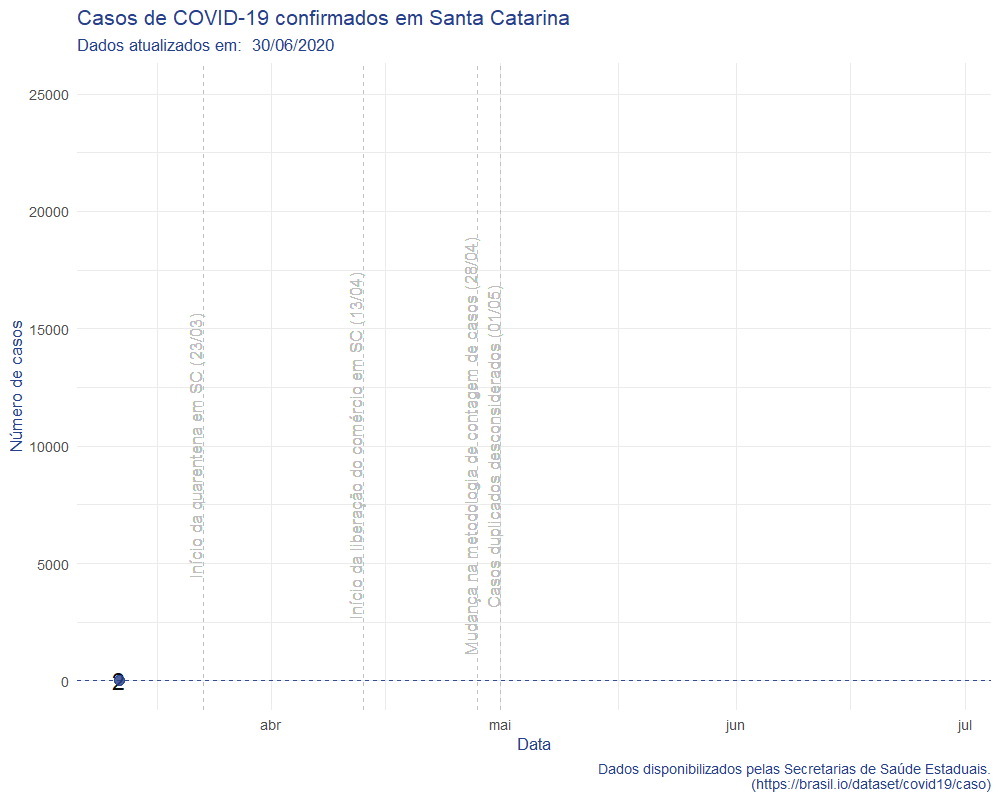

```{r setup, include=FALSE}
knitr::opts_chunk$set(echo = TRUE)

#these libraries are necessary
library(readxl)
library(httr)
library(ggplot2)
library(dplyr)
library(tidyr)
library(ggrepel)
library(plotly)
library(sf)
library(leaflet)
library(jsonlite)
library(brazilmaps)
library(tweenr)
library(gifski)
library(extrafont)
library(scales)
library(cowplot)
# library(ggflags)
options(scipen=999)
options(browser='false')

# Load Chart Studio API
Sys.setenv("plotly_username"=Sys.getenv("PLOTLY_USERNAME"))
Sys.setenv("plotly_api_key"=Sys.getenv("PLOTLY_API_KEY"))

# If prod = T, publish plots online
prod = T

```

## Acompanhamento COVID-19

```{r, echo=FALSE, warning=FALSE, message=FALSE}
# Please note that this script updates every day automatically using the time of your computer. Hence, it might show an error message if you try to download the file before we have updated it.

#create the URL where the dataset is stored with automatic updates every day

readUrl <- function() {
    out <- tryCatch(
        {
            # Just to highlight: if you want to use more than one 
            # R expression in the "try" part then you'll have to 
            # use curly brackets.
            # 'tryCatch()' will return the last evaluated expression 
            # in case the "try" part was completed successfully

            message("Obtendo dados mais recentes da ECDC")

            url <- paste("https://www.ecdc.europa.eu/sites/default/files/documents/COVID-19-geographic-disbtribution-worldwide-",format(Sys.Date()), ".xlsx", sep = "")

            #download the dataset from the website to a local temporary file
            GET(url, authenticate(":", ":", type="ntlm"), write_disk(tf <- tempfile(fileext = ".xlsx")))
            data <- read_excel(tf)
            # The return value of `readLines()` is the actual value 
            # that will be returned in case there is no condition 
            # (e.g. warning or error). 
            # You don't need to state the return value via `return()` as code 
            # in the "try" part is not wrapped insided a function (unlike that
            # for the condition handlers for warnings and error below)
            
        },
        error=function(cond) {
            message("Arquivo ainda não atualizado:")
            message("Utilizando dados do dia anterior")
            # Choose a return value in case of error
             url <- paste("https://www.ecdc.europa.eu/sites/default/files/documents/COVID-19-geographic-disbtribution-worldwide-",format(Sys.Date() - 1), ".xlsx", sep = "")

            #download the dataset from the website to a local temporary file
            tf <- tempfile(fileext = ".xlsx") 
            GET(url, authenticate(":", ":", type="ntlm"), write_disk(tf))
            data <- read_excel(tf)
            return(data)
            
        },
        warning=function(cond) {
            message("URL caused a warning:")
            message("Here's the original warning message:")
            message(cond)
            # Choose a return value in case of warning
            return(NULL)
        },
        finally={
        # NOTE:
        # Here goes everything that should be executed at the end,
        # regardless of success or error.
        # If you want more than one expression to be executed, then you 
        # need to wrap them in curly brackets ({...}); otherwise you could
        # just have written 'finally=<expression>' 
        }
    )    
    return(out)
}

data <- readUrl()
data <- data %>% select(DateRep = dateRep, Day = day, Month = month, Year = year, Cases = cases, Deaths = deaths, 
                        CountriesAndTerritories = countriesAndTerritories, GeoId = geoId, 
                        CountryterritoryCode = countryterritoryCode, PopData2018 = popData2018)
# Prepare data

dados_preparados_d0 <- data %>% 
  filter(Cases > 0 ) %>% 
  arrange(DateRep,GeoId) %>%
  group_by(GeoId) %>% 
  mutate(sum_cases = cumsum(Cases),
         sum_deaths = cumsum(Deaths),
         days_from_first = as.Date(DateRep, format= "%Y-%m-%d") - as.Date(min(DateRep), format= "%Y-%m-%d"),
         g_cases = ((Cases- lag(Cases))/lag(Cases))*100,
         g_deaths = ((Deaths-lag(Deaths))/lag(Deaths))*100) %>% 
  select(DateRep,GeoId,sum_cases,sum_deaths, days_from_first,g_cases,g_deaths)

dados_preparados_d100 <- dados_preparados_d0 %>% 
  filter(sum_cases > 100 ) %>% 
  arrange(DateRep,GeoId) %>%
  group_by(GeoId) %>% 
  mutate(days_from_100th = as.Date(DateRep, format= "%Y-%m-%d") - as.Date(min(DateRep), format= "%Y-%m-%d")) %>% 
  select(DateRep,GeoId,days_from_100th)

dados_completos <- data %>% 
  left_join(dados_preparados_d0, by= c("GeoId" = "GeoId", "DateRep" = "DateRep")) %>% 
  left_join(dados_preparados_d100, by= c("GeoId" = "GeoId", "DateRep" = "DateRep"))
```

Esta página busca servir como um compilado de gráficos informativos sobre a evolução da epidemia de coronavírus (COVID-19) no mundo, no Brasil em regiões brasileiras. Ela será atualizada conforme novos dados fiquem disponíveis.

Considerando a evolução dos casos confirmados em números absolutos a partir do Dia 0, o Brasil segue uma evolução semelhante ao observado na China em Janeiro, porém com uma distribuição maior entre regiões em comparação com o caso Chinês onde a região de Hubei foi duramente atingida.


```{r, echo=FALSE, warning=FALSE, message=FALSE}
#Create labels
dados_selecionados <- dados_completos %>% 
  filter(GeoId %in% c('BR','US','CN','FR','IT','ES','KR'))

dados_rotulos <- dados_selecionados %>% 
  group_by(GeoId) %>% 
  arrange(desc(sum_cases)) %>% 
  slice(1)


labels <- c( "EUA","Brasil","China", "França","Itália","Espanha","Coréia do Sul")
breaks <- c('US',"BR",'CN','FR','IT','ES','KR')
p <- dados_selecionados %>% 
  ggplot(aes(x=days_from_first, y=sum_cases, color=GeoId, linetype=GeoId,label=GeoId)) + geom_line(size=1) + 
  scale_y_log10() +
  theme_minimal() +
  labs(title = paste("Evolução após 1º caso, Covid-19 - ",format(Sys.time(), "%d/%m/%Y")), caption = "Em escala logaritmica.Os dados são atualizados diariamente.\n Fonte:https://www.ecdc.europa.eu/sites/default/files/documents/COVID-19-geographic-disbtribution-worldwide") + xlab("Dias desde 1º caso") + ylab("Casos confirmados") +
  scale_color_manual(name="País",labels=labels, breaks=breaks,values=c("red","#bdc2b0",'#cee588','#ff9872','#95b6cf','#455a64',"#f9d84e")) +
  scale_linetype_manual(name="País",labels=labels, breaks=breaks, values=c(1,2,3,4,5,6,7)) +
theme(legend.position="bottom",plot.title = element_text(hjust = 0.5)) 


  # Upload to chart studio
# if (prod == TRUE) {api_create(p, filename = "covid-world-1st-plot")}
```

Se olharmos a partir do 100º caso, quando é possível ter uma ideia melhor de tendências, notamos que a inclinação da curva brasileira é um pouco menor que de países onde a doença está em estágio crítico como Itália e Espanha.


```{r, echo=FALSE, warning=FALSE, message=FALSE}
#Create labels
dados_selecionados <- dados_completos %>% 
  filter(GeoId %in% c('BR','US','CN','FR','IT','ES','KR'))

dados_rotulos <- dados_selecionados %>% 
  group_by(GeoId) %>% 
  arrange(desc(sum_cases)) %>% 
  slice(1)


labels <- c( "EUA","Brasil","China", "França","Itália","Espanha","Coréia do Sul")
breaks <- c('US',"BR",'CN','FR','IT','ES','KR')
p <- dados_selecionados %>% 
  ggplot(aes(x=days_from_100th, y=sum_cases, color=GeoId, linetype=GeoId,label=GeoId)) + geom_line(size=1)+ 
  scale_y_log10()  + theme_minimal() + labs(title = paste("Evolução após 100º caso,Covid-19 - ",format(Sys.time(), "%d/%m/%Y")), caption = "Em escala logaritmica.Os dados são atualizados diariamente.\n Fonte:https://www.ecdc.europa.eu/sites/default/files/documents/COVID-19-geographic-disbtribution-worldwide") + xlab("Dias desde 100º caso") + ylab("Casos confirmados") +
  scale_color_manual(name="País",labels=labels, breaks=breaks,values=c("red","#bdc2b0",'#cee588','#ff9872','#95b6cf','#455a64',"#f9d84e"))+
  scale_linetype_manual(name="País",labels=labels, breaks=breaks, values=c(1,2,3,4,5,6,7))+
theme(legend.position="bottom",plot.title = element_text(hjust = 0.5))

p %>% ggplotly()

  # Upload to chart studio
# if (prod == TRUE) {api_create(p, filename = "covid-world-100th-plot")}
```

Um ponto importante é considerar a evolução da epidemia em termos relativos, isto é, qual o percentual de pessoas infectadas na população de uma região. Esse indicador é chamado de incidência, ou quando considerado em relação ao número de pessoas expostas, é chamado de ~taxa de ataque~. Como, em tese, não há pessoas com imunidade conhecida ao COVID-19 é possível dizer que ambas as taxas são aproximadamente iguais.

```{r, echo=FALSE, warning=FALSE, message=FALSE}
library(wbstats)
bm_pop <- wb(country = "all", indicator = c("SP.POP.TOTL","SH.MED.BEDS.ZS"),mrv=1,return_wide = T)
bm_med_beds <- wb(country = "all", indicator = c("SH.MED.BEDS.ZS"),return_wide = T) %>% 
  group_by(iso2c) %>% 
  arrange(desc(date)) %>% 
  slice(1)

dados_com_estatisticas <- dados_completos %>% 
  left_join(bm_pop %>% select(population = "SP.POP.TOTL", iso2c)
              ,by = c("GeoId" = "iso2c")) %>% 
  left_join(bm_med_beds %>% select(med_beds = "SH.MED.BEDS.ZS", iso2c)
              ,by = c("GeoId" = "iso2c"))

dados_com_estatisticas <- dados_com_estatisticas %>% 
  mutate(cases_per_1000 = sum_cases/(population/1000),
         med_bed_need_est = cases_per_1000 * 0.2)

dados_selecionados_estat <- dados_com_estatisticas %>% 
  filter(GeoId %in% c('BR','US','CN','FR','IT','ES','KR'))


dados_rotulos <- dados_selecionados_estat %>% 
  filter(GeoId %in% c('BR','US','CN','FR','IT','ES','KR')) %>%
  group_by(GeoId) %>% 
  arrange(desc(cases_per_1000)) %>% 
  slice(1) 

p<- dados_selecionados_estat %>% 
  ggplot(aes(x=days_from_100th, y=cases_per_1000, color=GeoId, linetype=GeoId, label=GeoId)) + geom_line(size=1)+ 
  xlim(0,80)+ labs(title = paste("Casos por 1000 habitantes - ",format(Sys.time(), "%d/%m/%Y")), caption = "Os dados são atualizados diariamente.\n Fonte:https://www.ecdc.europa.eu/sites/default/files/documents/COVID-19-geographic-disbtribution-worldwide") + xlab("Dias desde 100º caso") + ylab("Casos confirmados/1000 habitantes") +
  scale_color_manual(name="País",labels=labels,   breaks=breaks,values=c("red","#bdc2b0",'#cee588','#ff9872','#95b6cf','#455a64',"#f9d84e"))+
  scale_linetype_manual(name="País",labels=labels, breaks=breaks, values=c(1,2,3,4,5,6,7)) +theme_minimal()

p %>% ggplotly()

# if (prod == TRUE) {api_create(p, filename = "covid-world-attack-plot")}
```


## Por regiões brasileiras

Quando observamos o cenário por região brasileira, notamos que embora SP apresente a maior quantidade de Casos Confirmados, outros estados estão em curvas semelhantes porém com algum atraso. Isso é esperado pois em teoria não há motivo para que a doença se espalhe mais ou menos entre diferentes populações. A velocidade do espalhamento da epidemia pode depender de concentração populacional, comportamentos regionais e, sobretudo, das medidas de distanciamento sociais adotadas em cada região. Ao longo das próximas semanas poderemos ter uma ideia de como essas medidas estão surtindo efeito em cada estado brasileiro. Os dados por estados foram compilados por [Wesley Cota](https://raw.githubusercontent.com/wcota/covid19br/master/cases-brazil-states.csv) e são mostrados para estados com mais de 10 casos confirmados.

```{r, echo=FALSE, warning=FALSE, message=FALSE}
# Credido ao Wison Cota por fazer essa agregação
casos_por_estado <- readr::read_csv("https://raw.githubusercontent.com/wcota/covid19br/master/cases-brazil-states.csv")
pop_por_cidade <-  readr::read_csv("cidades.csv")
pop_por_estado <- pop_por_cidade %>% 
  group_by(uf) %>% 
  summarise(pop_2019 = sum(Pop_2019))


casos_por_estado_d0 <- casos_por_estado  %>% 
  filter(totalCases > 0 ) %>% 
  arrange(date,state) %>%
  group_by(state) %>% 
  mutate(days_from_first = as.Date(date, format= "%Y-%m-%d") - as.Date(min(date), format= "%Y-%m-%d"),
         g_new_cases = ((newCases- lag(newCases))/lag(newCases))*100,
         g_total_cases = ((totalCases- lag(totalCases))/lag(totalCases))*100
        ) %>% 
  select(date,state,days_from_first,g_new_cases,g_total_cases)

casos_por_estado_d10 <- casos_por_estado  %>% 
  filter(totalCases > 10 ) %>% 
  arrange(date,state) %>%
  group_by(state) %>% 
  mutate(days_from_10th = as.Date(date, format= "%Y-%m-%d") - as.Date(min(date), format= "%Y-%m-%d")
        ) %>% 
  select(date,state,days_from_10th)


casos_por_estado <- casos_por_estado %>% 
  left_join(casos_por_estado_d0, by = c("date"= "date", "state" = "state")) %>% 
  left_join(casos_por_estado_d10, by = c("date"= "date", "state" = "state")) %>% 
  left_join(pop_por_estado, by = c("state" = "uf")) %>% 
  mutate(total_cases_pop = totalCases/(pop_2019 / 100000))


dados_rotulos <- casos_por_estado %>% 
  filter(totalCases > 10 & state != 'TOTAL') %>%
  group_by(state) %>% 
  arrange(desc(totalCases)) %>% 
  slice(1) 

p_lin <- casos_por_estado %>% 
  filter(totalCases > 10 & state != 'TOTAL' & date < Sys.Date()) %>% 
  ggplot(aes(x=days_from_10th, y=totalCases, color=state,linetype=state,label=state)) + geom_line(size=1)+ 
  labs(title = paste("Evolução por estado (linear) - ",format(Sys.time(), "%d/%m/%Y")), caption = "Em escala logaritmica. Apenas estados com mais de 10 casos.Os dados são atualizados diariamente.\n Fonte:https://raw.githubusercontent.com/wcota/covid19br/master/cases-brazil-states.csv") + xlab("Dias desde 10º caso") + ylab("Casos confirmados")+ theme_minimal()

p_lin %>% ggplotly()

# if (prod == TRUE) {api_create(p_lin, filename = "covid-states-lin-plot")}
# 
### Log scale
x_seq <-data_frame(days_from_10th = seq(0,max(as.integer(casos_por_estado$days_from_10th),na.rm=T)+2,1)) %>% 
  mutate(
    y_log_1d = 10 * 2^(days_from_10th),
    y_log_2d = 10 * 2^(1/2 * days_from_10th), 
    y_log_5d = 10 * 2^(1/5 * days_from_10th),                                                                                                 y_log_10d = 10 * 2^(1/10 * days_from_10th))      

x_seq %>% ggplot(aes(x=days_from_10th, y = y_log_1d)) +geom_line() + geom_line(aes(y=y_log_2d)) + scale_y_log10()

  
  
p_log <- casos_por_estado %>% 
  filter(totalCases > 10 & state != 'TOTAL' & date < Sys.Date()) %>% 
  ggplot(aes(x=days_from_10th, y=totalCases)) + geom_line(aes(color=state,linetype=state,label=state),size=1) +
   geom_line(aes(x=days_from_10th,y=y_log_2d),data=x_seq, color = "grey") +
  geom_line(aes(x=days_from_10th,y=y_log_5d),data=x_seq, color = "grey") +
  geom_line(aes(x=days_from_10th,y=y_log_10d),data=x_seq, color = "grey") +
  scale_y_continuous(trans="pseudo_log") + labs(title = paste("Evolução por estado (em log) - ",format(Sys.time(), "%d/%m/%Y")), caption = "Em escala logaritmica. Apenas estados com mais de 10 casos.Os dados são atualizados diariamente.\n Fonte:https://raw.githubusercontent.com/wcota/covid19br/master/cases-brazil-states.csv") + xlab("Dias desde 10º caso") + ylab("Casos confirmados")+ theme_minimal() + annotate("text", x = c(max(x_seq$days_from_10th),max(x_seq$days_from_10th),max(x_seq$days_from_10th)), y = c(max(x_seq$y_log_10d),max(x_seq$y_log_5d),max(x_seq$y_log_2d)), label = c("10 dias para \n duplicar","5 dias para \n duplicar","2 dias para \n duplicar"), size=3, color = "grey",vjust=-1)

p_log %>% ggplotly()

# if (prod == TRUE) {api_create(p_log, filename = "covid-states-log-plot")}


## Per 100.000

p_lin_1000 <- casos_por_estado %>% 
  filter(totalCases > 10 & state != 'TOTAL' & date < Sys.Date()) %>% 
  ggplot(aes(x=days_from_10th, y=total_cases_pop, color=state,linetype=state,label=state)) + geom_line(size=1)+ 
  labs(title = paste("Casos por 100mil/hab (linear) - ",format(Sys.time(), "%d/%m/%Y")), caption = "Em escala logaritmica. Apenas estados com mais de 10 casos.Os dados são atualizados diariamente.\n Fonte:https://raw.githubusercontent.com/wcota/covid19br/master/cases-brazil-states.csv") + xlab("Dias desde 10º caso") + ylab("Casos confirmados")+ theme_minimal()

p_lin_1000 %>% ggplotly()

# if (prod == TRUE) {api_create(p_lin_1000, filename = "covid-states-pop-lin-plot")}

```


# No estado de Santa Catarina


Olhando para o estado de Santa Catarina, com dados disponibilizados pelas [Secretarias de Saúde Estaduais](https://brasil.io/dataset/covid19/caso), podemos avaliar a evolução dos casos no estado.


```{r, echo=FALSE, warning=FALSE, message=FALSE,include = FALSE}
## api for update data of Covid19 cases
read_CityDataCovid <- function() {
  # read api url for update  
  url <- "https://brasil.io/api/dataset/covid19/caso/data?format=json"
  tf <- GET(url)
  
  content <- httr::content(tf, as = 'text')
  content_from_json <- jsonlite::fromJSON(content)
  out<- content_from_json$results
  # verify more pages of data and get all
  while(!is.null(content_from_json$`next`)){
    url <- content_from_json$`next`
    tf <- GET(url)
    content <- httr::content(tf, as = 'text')
    content_from_json <- jsonlite::fromJSON(content)
    results_df_np<- content_from_json$results
    out <- bind_rows(out, results_df_np)
  }
    return(out)
}
# get data
data <- read_CityDataCovid()
data$date <- as.Date(data$date)
data_SC_state <- data %>% filter(state == "SC"  & place_type == "state")%>% arrange(date) %>% mutate(day=1+(row_number()-1)*7,ease="linear") 
data <- data %>% filter(state == "SC"  & place_type == "city")
data$date <- as.Date(data$date)

# lat/lng data of cities
cidade_latlng <- read.csv("municipios_latlng.csv")
cidade_latlng <- cidade_latlng %>% select(codigo_ibge = 1, lat = latitude, lng = longitude)
cidade_latlng$codigo_ibge <- as.character(cidade_latlng$codigo_ibge)
data <- left_join(data, cidade_latlng, by = c("city_ibge_code" = "codigo_ibge"))
last_data <- data %>% filter(is_last == T)

# geometry data of cities
shp_sf <- get_brmap("City", geo.filter = list(State = 42))
shp_sf$City <- as.character(shp_sf$City)
shp_sf <- st_as_sf(shp_sf)%>%
 st_transform(4326)
shp_sf <- shp_sf %>% filter(City %in% last_data$city_ibge_code)
shp_sf_last_data <- left_join(shp_sf,last_data, by = c("City" = "city_ibge_code"))
shp_sf <- left_join(shp_sf,data, by = c("City" = "city_ibge_code"))

```

\ 

### Evolução dos casos em Santa Catarina

\ 

```{r, echo=FALSE, warning=FALSE, message=FALSE,include = FALSE}
# prepare for animation. methodology taken from http://lenkiefer.com/2018/08/11/state-employment-dataviz/
plot_data_tween_sc <- tween_elements(data_SC_state,
                 time = "day",  group="ease",
                 ease="ease", nframes = nrow(data_SC_state))

df_tween_appear_SC <- tween_appear(plot_data_tween_sc, time='day', nframes = nrow(data_SC_state)*3)
N <- max(df_tween_appear_SC$.frame)

# Function for plots -----
make_plot_appear <- function(i, maxi=N){
  g.plot <- ggplot(data=df_tween_appear_SC, aes(x=date,y=confirmed,label=confirmed,3))+
    geom_line(alpha=0)+
    geom_line(data= .%>% filter(.frame==i, .age> -3.5), color="#27408b",size=1.05) +
    geom_text(data=  .%>% filter(.frame==i, .age> -3.5) %>% tail(1),  size=5, alpha=0.95,color="black",nudge_y=.0005)+
    geom_point(data=  .%>% filter(.frame==i, .age> -3.5) %>% tail(1), size=3, alpha=.82,color="#27408b")+
    geom_hline(data=  .%>% filter(.frame==i, .age> -3.5) %>% tail(1), aes(yintercept=confirmed),alpha=0.95, linetype=2,color="#27408b")+
    theme_minimal()+
    scale_y_continuous()+
    scale_color_manual(name="",values=c(rgb(103,180,75, maxColorValue = 256),"#f37735","#27408b"))+
    theme(text = element_text(color = "#27408b"))+
    labs(y="Número de casos", x="Data",
         title="Casos de COVID-19 confirmados em Santa Catarina",
         subtitle=paste("Dados atualizados em: ",format(Sys.time(), "%d/%m/%Y")),
         caption="Dados disponibilizados pelas Secretarias de Saúde Estaduais.\n(https://brasil.io/dataset/covid19/caso)")
    plot_grid(g.plot,rel_heights=c(5,1),ncol=1)
}

# write giff ----
gif_file <- save_gif({for (i in seq(1,N)){  
  g<- make_plot_appear(i)
  print(g)
  print(paste(i,"out of",N))
}
  for (ii in 1:30){
    print(g)
    print(paste(ii,"out of",30))
  }
}, gif_file= paste0("./COVID19_SC.gif"),width = 1200, height = 1000, res = 144, delay=1/15)

# utils::browseURL(gif_file)
```



\ 

### Total de casos por cidade catarinense

\ 

Total de casos de Covid-19 confirmados nas cidades catarinenses:
```{r, echo=FALSE, warning=FALSE, message=FALSE}
#plot whole cases in SC's cities

leaflet(last_data, width = "100%") %>% addTiles() %>%
  addProviderTiles(providers$CartoDB.Positron) %>% 
  addCircleMarkers(
    radius = ~sqrt(last_data$confirmed) * 3,
    fillOpacity = 0.5, stroke = F, 
    popup = paste0("<b>Cidade: </b>", last_data$city,"<br>",
                   "<b>Casos Confirmados: </b>", last_data$confirmed)
 )

```

\ 

### Casos por 100k habitantes nas cidades catarinenses

\ 

Total de casos de Covid-19 confirmados por 100 mil habitantes nas cidades catarinenses:
```{r, echo=FALSE, warning=FALSE, message=FALSE}
## create the colors quantiles
binpal <- colorQuantile(heat.colors(10), shp_sf_last_data$confirmed_per_100k_inhabitants, n = 10, reverse = T)

# plot heatmap of Covid-19 cases in SC
leaflet(shp_sf_last_data, width = "100%") %>%
  addProviderTiles(providers$CartoDB.Positron) %>%
  addPolygons(data = shp_sf_last_data,
              smoothFactor = 0.5,
              fillOpacity = 0.5,
              weight = 0.5,
              color = ~binpal(confirmed_per_100k_inhabitants),
              opacity = 0.8,
              highlightOptions = highlightOptions(color = "black",
                                                  weight = 2,
                                                  bringToFront = TRUE),
              popup = ~paste(sep = " ",
                             "<b>Cidade: </b>", shp_sf_last_data$city, "<br>",
                             "<b>Casos confrmados: </b>", shp_sf_last_data$confirmed, "<br>",
                             "<b>Casos por 100k habitantes: </b>", shp_sf_last_data$confirmed_per_100k_inhabitants)) %>% 
        addLegend("bottomright",
                  title = "Casos confirmados por<br>100k habitantes", 
                  pal = binpal, 
                  values = ~confirmed_per_100k_inhabitants, 
                  opacity = 0.8,
                  labFormat = function(type, cuts, p) {
                    n = length(cuts)
                    p = paste0(round(p * 100), '%')
                    cuts = paste0(formatC(cuts[-n]), " - ", formatC(cuts[-1]))
                    # mouse over the legend labels to see the percentile ranges
                    paste0('<span title="', p[-n], " - ", p[-1], '">', cuts,'</span>')})

```

\ 

### Casos por microrregião do estado

\ 

```{r, echo=FALSE, warning=FALSE, message=FALSE}
shp_mr <- get_brmap("MicroRegion", geo.filter = list(State = 42)) %>% sf::st_set_geometry(NULL)
shp_mr <- left_join(shp_mr,shp_sf %>% select(-nome), by = "MicroRegion")
shp_mr <- shp_mr %>% group_by(date, MicroRegion, nome) %>% 
  summarise(confirmed_mr = sum(confirmed))


confirmed_cases_city <- ggplot(
  shp_mr,
  aes(x = date, y=confirmed_mr, group = nome,colour = factor(nome), text = paste0("Microrregião: ", nome,"<br>","Casos Confirmados Acumulados: ", confirmed_mr, "<br>", "Data: ", date))
  ) +
  geom_line()+
  scale_color_viridis_d() +
  labs(title = paste("Número de casos de COVID-19 por microrregião catarinense - ",format(Sys.time(), "%d/%m/%Y"))) + xlab("Data") + ylab("Casos confirmados")+ theme_minimal() +
  theme(legend.position = "none")
ggplotly(confirmed_cases_city, dynamicTicks = TRUE, tooltip = c("text")) %>%
  rangeslider() %>%
  layout(hovermode = "x")

```


## Códigos

Os códigos utilizados e análises estão disponíveis em https://github.com/dpavancini/covid19.


