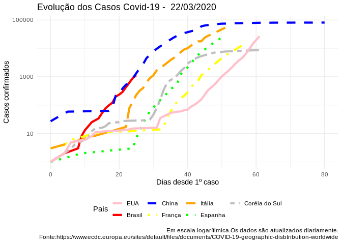

Acompanhamento de casos Covid-19
================

Acompanhamento
--------------

Os dados são obtidos de [deste link](https://www.ecdc.europa.eu/sites/default/files/documents/COVID-19-geographic-disbtribution-worldwide-) e atualizado diariamente.

Dados Gerais
------------

O gráfico abaixo apresenta as linhas de crescimento dos casos confirmados e mortes por Covid 19 até o momento no mundo:

Para fins de comparação com estimativas internacionais, o gráfico abaixo apresenta a curva de casos confirmados cumulativa a partir do dia 0:

