Acompanhamento Covid 19
================

Os dados são obtidos de [Centro Europeu de Controle de Doenças - ECDC](https://www.ecdc.europa.eu/sites/default/files/documents/COVID-19-geographic-disbtribution-worldwide-2020-03-22.xlsx) e atualizado diariamente. Note que o link deve ser atualizado com a data mais recente em caso de download manual.

Outras fontes de projetos brasileiros e internacionais de acompanhamento da epidemia:

-   <https://labs.wesleycota.com/sarscov2/br/>
-   <https://covid-simulator.3778.care/>
-   <https://www.worldometers.info/coronavirus/>
-   <https://www.covidvisualizer.com/>
-   <https://github.com/CSSEGISandData/COVID-19/tree/master/csse_covid_19_data>
-   <https://github.com/peixebabel/COVID-19>
-   [Em formato Tableau](https://www.tableau.com/covid-19-coronavirus-data-resources)

Dados Gerais
------------

O gráfico abaixo apresenta as linhas de crescimento dos casos confirmados e mortes por Covid 19 até o momento no mundo:


### Brasil

Para o caso brasileiro, o cenário atual é o seguinte:


Para fins de comparação com estimativas internacionais, o gráfico abaixo apresenta a curva de casos confirmados cumulativa a partir do dia 0:


Outro ponto muitas vezes levantado é a "Taxa de duplicação", isto é, quantos dias levaria para dobrar o número de casos/mortes seguindo a taxa de crescimento atual.

``` r
x_max = max(dados_selecionados$days_from_first,na.rm=T)

dados_selecionados %>% 
  ggplot(aes(x=days_from_first, y=d_rate_cases, color=GeoId, linetype=GeoId,label=GeoId)) + geom_line(size=1)+ 
  scale_y_continuous(trans="pseudo_log") +
  scale_y_log10() +
 theme_minimal() + labs(title = paste("Taxa de duplicação de Casos - ",format(Sys.time(), "%d/%m/%Y")), caption = "Em escala logaritmica.Os dados são atualizados diariamente.\n Fonte:https://www.ecdc.europa.eu/sites/default/files/documents/COVID-19-geographic-disbtribution-worldwide") + xlab("Dias desde 1º caso") + ylab("Dias para duplicar") +
  scale_color_manual(name="País",labels=labels, breaks=breaks,values=c("red","#bdc2b0",'#cee588','#ff9872','#95b6cf','#455a64',"#f9d84e"))+
  scale_linetype_manual(name="País",labels=labels, breaks=breaks, values=c(1,2,3,4,5,6,7))+
theme(legend.position="bottom",plot.title = element_text(hjust = 0.5))+geom_label_repel(data = dados_rotulos,show.legend = FALSE) + custom_theme + geom_hline(yintercept=2, color = "grey") + geom_hline(yintercept=5, color = "grey") + annotate("text", x = c(x_max - 5,x_max -5), y = c(2,5), label = c("2 dias para duplicar","5 dias para duplicar"), size=3, color = "grey",vjust=-1)
```

    ## Scale for 'y' is already present. Adding another scale for 'y', which
    ## will replace the existing scale.

    ## Don't know how to automatically pick scale for object of type difftime. Defaulting to continuous.

    ## Warning: Removed 310 rows containing missing values (geom_path).

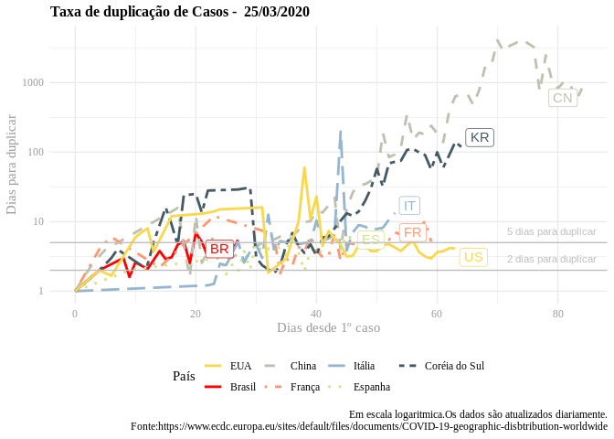

### Dados Por População

Os gráficos abaixo trazem comparativos utilizando dados relativos ao tamanho da população e número de leitos hospitalares disponíveis por 1000 habitantes. A fonte dos dados é o Banco Mundial:


Já o gráfico abaixo compara uma estimativa de Casos com necessidade de internação de 20% (segundo estudo do Imperial College) e a capacidade hospitalar de cada país, considerando uma distribuição uniforme dos casos (diferente do atual caso italiano onde há concentração de casos na Lombardia e a taxa de ocupação de leitos nessa região é muito superior à média do país:

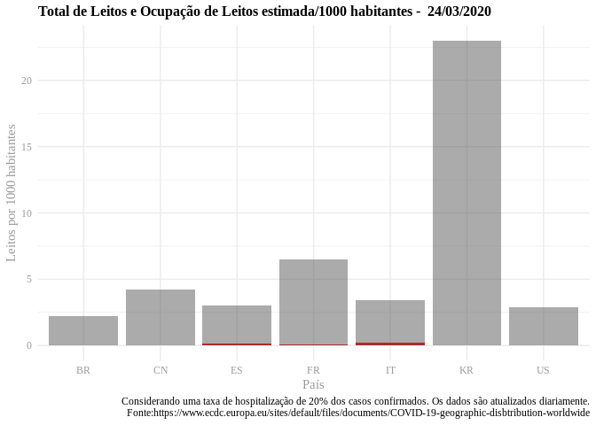

### Evolução por Estado

Abaixo são feitos comparativos de Casos por Estados brasileiros a partir de dados compilados por [Wesley Cota](https://raw.githubusercontent.com/wcota/covid19br/master/cases-brazil-states.csv). É sabido que os dados de Casos confirmados dependem muito da quantidade de testes realizados e dados de mortes são geralmente mais confiáveis. À medida que evolua a epidemia esperamos ter dados mais confiáveis.


E a taxa de duplicação por estado:

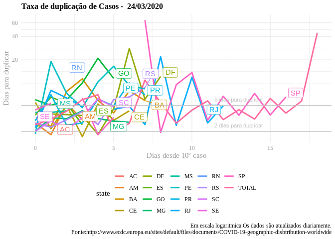

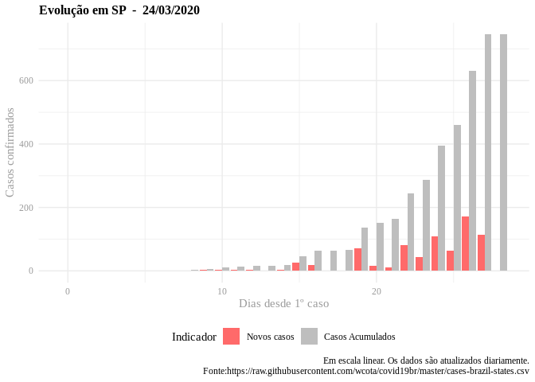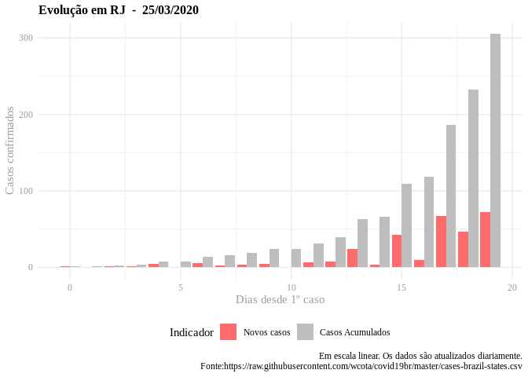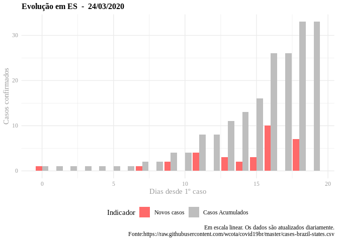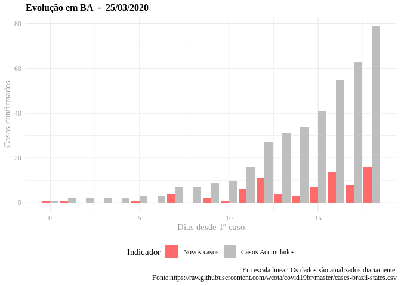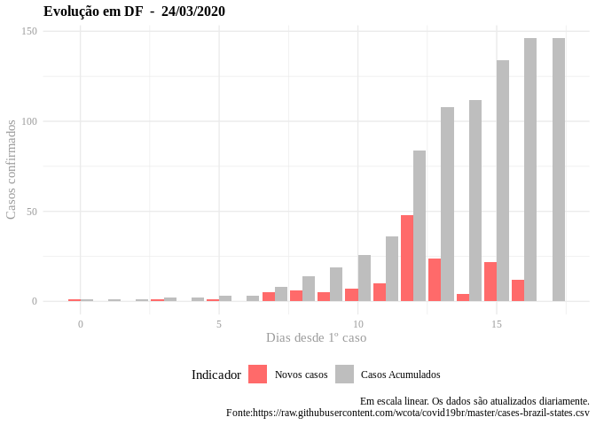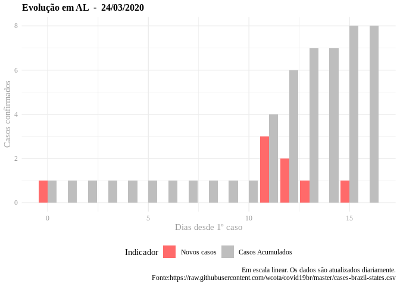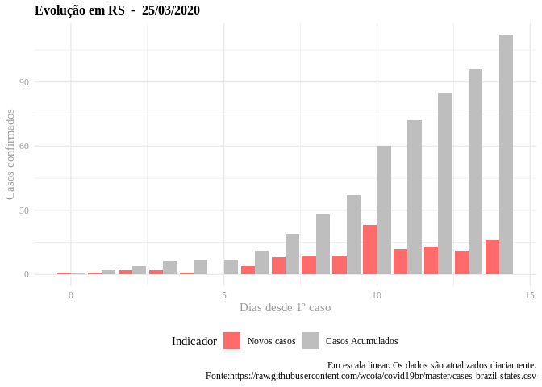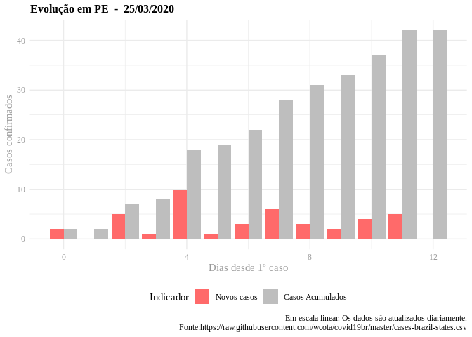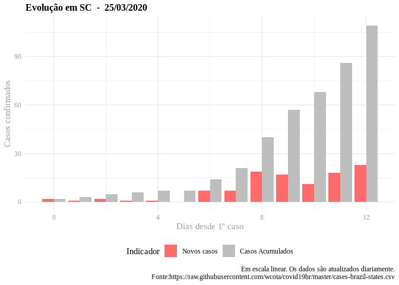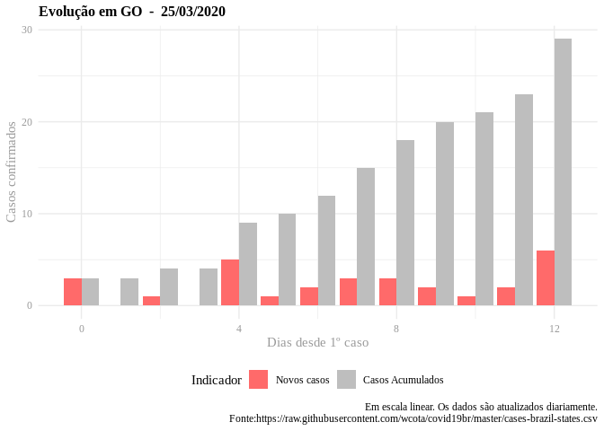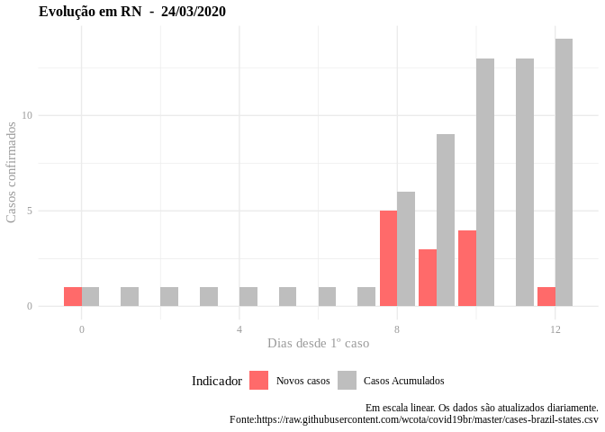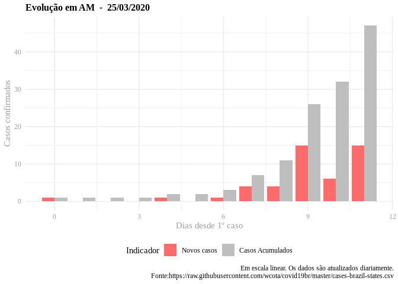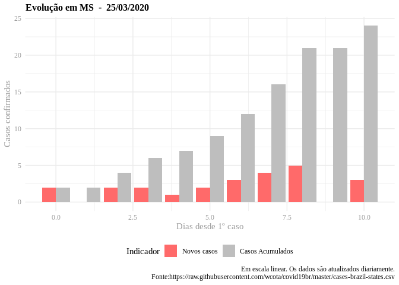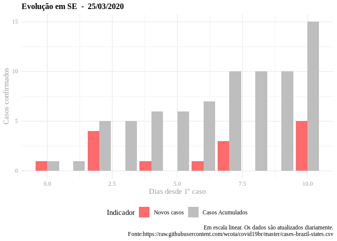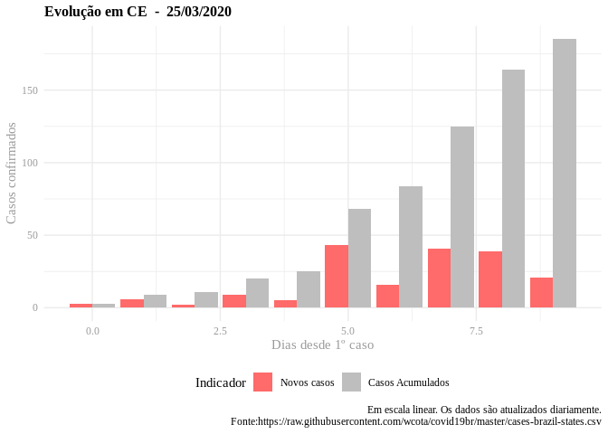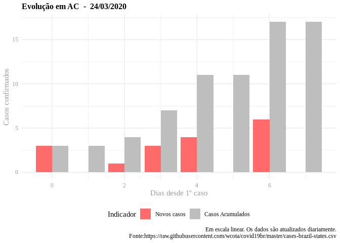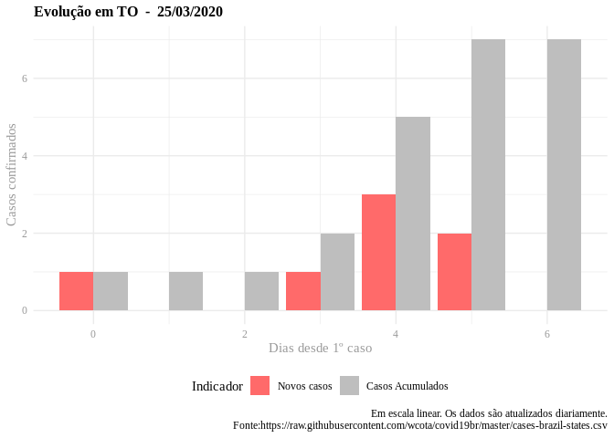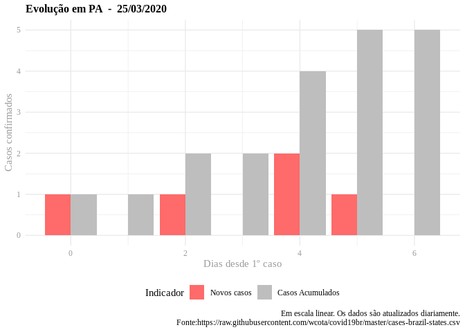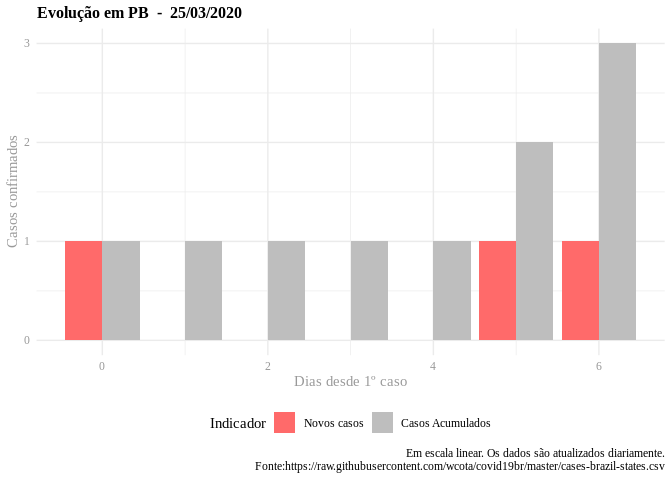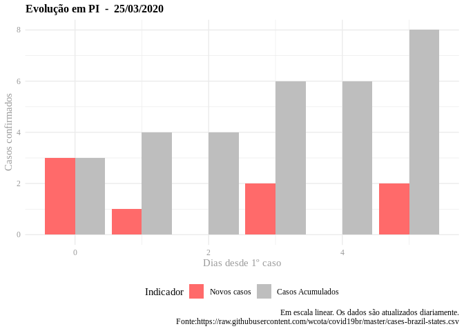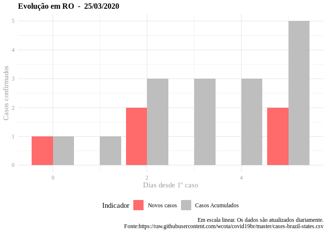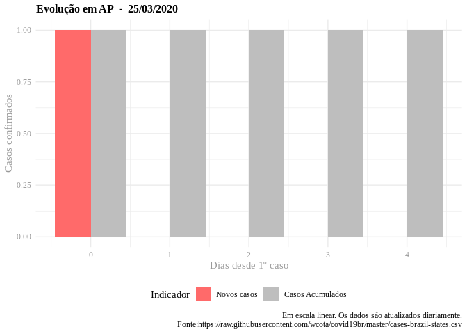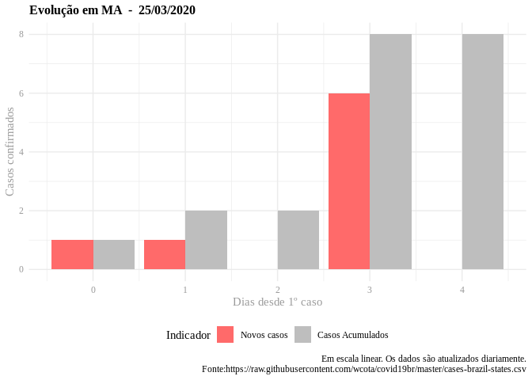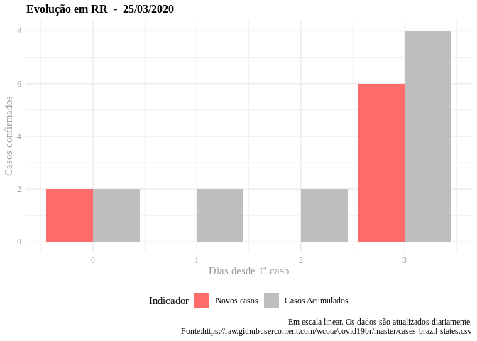

Nota:
-----

Este projeto é de acesso público e meramente informativo. Qualquer dado deve ser validado com fontes oficiais.
