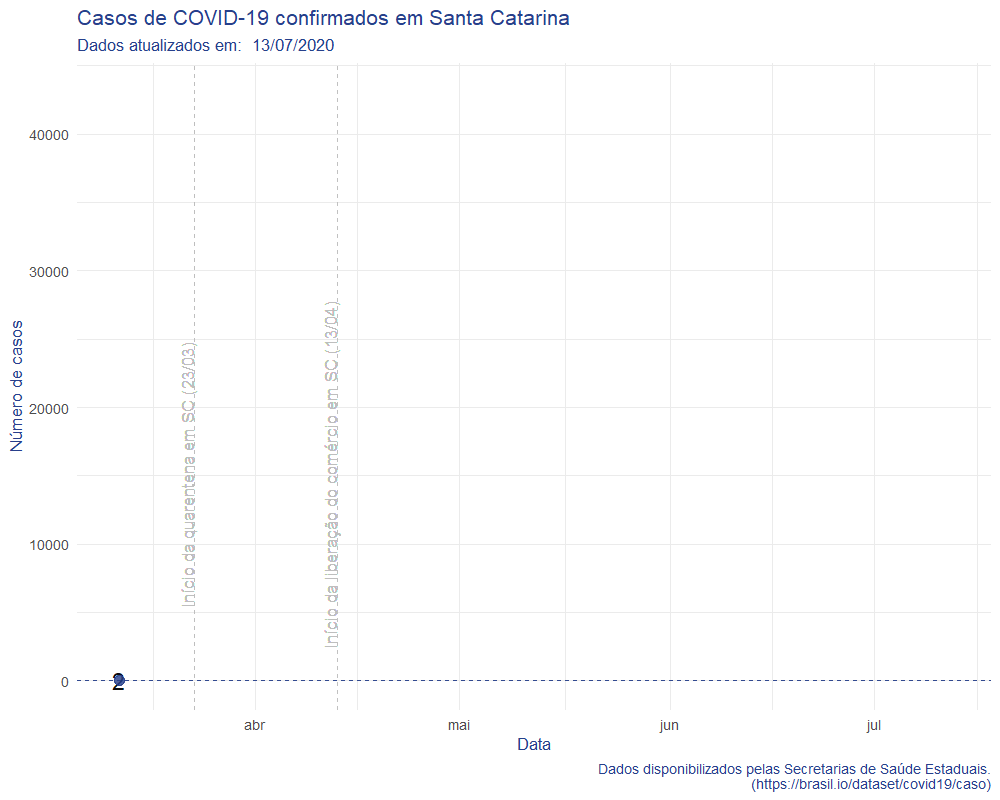

```{r setup, include=FALSE}
knitr::opts_chunk$set(echo = TRUE)

#these libraries are necessary
library(readxl)
library(httr)
library(ggplot2)
library(dplyr)
library(tidyr)
library(ggrepel)
library(plotly)
library(sf)
library(leaflet)
library(jsonlite)
library(brazilmaps)
library(tweenr)
library(gifski)
library(extrafont)
library(scales)
library(cowplot)
library(htmltools)
options(scipen=999)
options(browser='false')

# Plot Margins

m <- list(l=100, r=100, t=100, b=100)

custom_layout <- function(pltly_obj,title,subtitle,source) {
  pltly_obj <- pltly_obj %>% layout(title=list(text=paste(title),
                                   font=list(family="Raleway", color="#000000",size=16),
                                   xref='paper',
                                   yref='paper',
                                   x=0,
                                   y=1.1,
                                   xanchor='left', 
                                   yanchor='top'),
                                   margin=m,
                                   autosize = F,
                                   annotations = list(list(x = 0, 
                                                      y = 1.1,
                                                      text = subtitle,
                                                      showarrow = F,
                                                      xref='paper',
                                                      yref='paper', 
                                                      xanchor='left', 
                                                      yanchor='top', 
                                                      xshift=0, 
                                                      yshift=-0.8,
                                                      font=list(size=14, color="#000000", family="Raleway")),
                                   list(x = 0.75, 
                                        y = -0.16,
                                        text = source, 
                                        showarrow = F,
                                        xref='paper',
                                        yref='paper', 
                                        xanchor='left', 
                                        yanchor='auto', 
                                        xshift=0, 
                                        yshift=0,
                                        font=list(size=12, color="grey", family="Raleway"))))
}
  
# Load Chart Studio API
Sys.setenv("plotly_username"=Sys.getenv("PLOTLY_USERNAME"))
Sys.setenv("plotly_api_key"=Sys.getenv("PLOTLY_API_KEY"))

# If prod = T, publish plots online
prod = T

```

## Acompanhamento COVID-19 - Santa Catarina

Olhando para o estado de Santa Catarina, com dados disponibilizados pelas [Secretarias de Saúde Estaduais](https://brasil.io/dataset/covid19/caso), podemos avaliar a evolução dos casos no estado.


```{r, echo=FALSE, warning=FALSE, message=FALSE,include = FALSE}
## api for update data of Covid19 cases
read_CityDataCovid <- function() {
  # read api url for update  
  url <- "https://brasil.io/api/dataset/covid19/caso/data/?"
  tf <- GET(url)
  
  content <- httr::content(tf, as = 'text')
  content_from_json <- jsonlite::fromJSON(content)
  out<- content_from_json$results
  # verify more pages of data and get all
  while(!is.null(content_from_json$`next`)){
    url <- content_from_json$`next`
    tf <- GET(url)
    content <- httr::content(tf, as = 'text')
    content_from_json <- jsonlite::fromJSON(content)
    results_df_np<- content_from_json$results
    out <- bind_rows(out, results_df_np)
  }
  # get the new cases in each day 
  calc_new_cases  <- function(out){
    x <- out %>% select(city_ibge_code) %>% filter(!is.na(city_ibge_code)) %>% distinct()
    new_cases <- data.frame()
    for (i in 1:nrow(x)) {
      city_data <- out %>% filter(city_ibge_code == x$city_ibge_code[i]) %>% arrange(as.Date(date))
      date <- city_data %>% select(date) %>% distinct()
      city_data$new_cases[1] <- city_data$confirmed[1]
      city_data$new_deaths[1] <- city_data$deaths[1]
      if(nrow(city_data) > 1){
        for (k in 2:nrow(city_data)) {
          city_data$new_cases[k] <- city_data$confirmed[k] - city_data$confirmed[k-1]
          city_data$new_deaths[k] <- city_data$deaths[k] - city_data$deaths[k-1]
        }
      }
      new_cases <- bind_rows(new_cases, city_data)
    }
    return(new_cases)
  }
  out <- calc_new_cases(out)
  return(out)
}

# get data
data <- read_CityDataCovid()
data$date <- as.Date(data$date)
data_SC_state <- data %>% filter(state == "SC"  & place_type == "state")%>% arrange(date) %>% mutate(day=1+(row_number()-1)*7,ease="linear") 
data <- data %>% filter(state == "SC"  & place_type == "city", !is.na(city_ibge_code), confirmed >0)

# lat/lng data of cities
cidade_latlng <- read.csv("municipios_latlng.csv")
cidade_latlng <- cidade_latlng %>% select(codigo_ibge = 1, lat = latitude, lng = longitude)
cidade_latlng$codigo_ibge <- as.character(cidade_latlng$codigo_ibge)
data <- left_join(data, cidade_latlng, by = c("city_ibge_code" = "codigo_ibge"))
data_SC_state <- left_join(data_SC_state, cidade_latlng, by = c("city_ibge_code" = "codigo_ibge"))
last_data <- data %>% filter(is_last == T)

# geometry data of cities
shp_sf <- get_brmap("City", geo.filter = list(State = 42))
shp_sf$City <- as.character(shp_sf$City)
shp_sf <- st_as_sf(shp_sf)%>%
 st_transform(4326)
shp_sf <- shp_sf %>% filter(City %in% last_data$city_ibge_code)
shp_sf_last_data <- left_join(shp_sf,last_data, by = c("City" = "city_ibge_code"))
shp_sf <- left_join(shp_sf,data, by = c("City" = "city_ibge_code"))

```

\ 

### Evolução dos casos em Santa Catarina

\ 

```{r, echo=FALSE, warning=FALSE, message=FALSE,include = FALSE}
# prepare for animation. methodology taken from http://lenkiefer.com/2018/08/11/state-employment-dataviz/
plot_data_tween_sc <- tween_elements(data_SC_state,
                 time = "day",  group="ease",
                 ease="ease", nframes = nrow(data_SC_state))

df_tween_appear_SC <- tween_appear(plot_data_tween_sc, time='day', nframes = nrow(data_SC_state)*3)
N <- max(df_tween_appear_SC$.frame)

# Function for plots -----
make_plot_appear <- function(i, maxi=N){
  g.plot <- ggplot(data=df_tween_appear_SC, aes(x=date,y=confirmed,label=confirmed,3))+
    geom_line(alpha=0)+
    geom_line(data= .%>% filter(.frame==i, .age> -3.5), color="#27408b",size=1.05) +
    geom_text(data=  .%>% filter(.frame==i, .age> -3.5) %>% tail(1),  size=5, alpha=0.95,color="black",nudge_y=.0005)+
    geom_point(data= .%>% filter(.frame==i, .age> -3.5) %>% tail(1), size=3, alpha=.82,color="#27408b")+
    geom_hline(data= .%>% filter(.frame==i, .age> -3.5) %>% tail(1), aes(yintercept=confirmed),alpha=0.95, linetype=2,color="#27408b")+
    theme_minimal()+
    scale_y_continuous()+
    scale_color_manual(name="",values=c(rgb(103,180,75, maxColorValue = 256),"#f37735","#27408b"))+
    theme(text = element_text(color = "#27408b"))+
    geom_vline(aes(xintercept= as.Date('2020-03-23')),ialpha=0.95, linetype=2,color="grey")+ 
    geom_text(aes(x = as.Date('2020-03-22'), label = "Início da quarentena em SC (23/03)", y = 1500), colour = "grey",angle=90,  vjust =0.5, text=element_text(size=10))+
    geom_vline(aes(xintercept= as.Date('2020-04-13')),alpha=0.95, linetype=2,color="grey")+
    geom_text(aes(x = as.Date('2020-04-12'), label = "Início da liberação do comércio em SC (13/04)", y = 1500), colour = "grey",angle=90,  vjust =0.5, text=element_text(size=9.5))+
    # geom_rect(aes(xmin=as.Date('2020-04-28'), xmax=as.Date('2020-04-30'), ymin=-Inf, ymax=Inf), alpha=0.3)+
    geom_vline(aes(xintercept= as.Date('2020-04-28')),alpha=0.95, linetype=2,color="grey")+
    geom_text(aes(x = as.Date('2020-04-27'), label = "Mudança na metodologia de contagem de casos (28/04)", y = 1500), colour = "grey",angle=90,  vjust =0.5, text=element_text(size=9.5))+
    geom_vline(aes(xintercept= as.Date('2020-05-01')),alpha=0.95, linetype=2,color="grey")+
    geom_text(aes(x = as.Date('2020-04-30'), label = "Casos duplicados desconsiderados (01/05)", y = 1500), colour = "grey",angle=90,  vjust =0.5, text=element_text(size=9.5))+
    labs(y="Número de casos", x="Data",
         title="Casos de COVID-19 confirmados em Santa Catarina",
         subtitle=paste("Dados atualizados em: ",format(Sys.time(), "%d/%m/%Y")),
         caption="Dados disponibilizados pelas Secretarias de Saúde Estaduais.\n(https://brasil.io/dataset/covid19/caso)")
    plot_grid(g.plot,rel_heights=c(5,1),ncol=1)
}

# write giff ----
gif_file <- save_gif({for (i in seq(1,N)){  
  g<- make_plot_appear(i)
  print(g)
  print(paste(i,"out of",N))
}
  for (ii in 1:30){
    print(g)
    print(paste(ii,"out of",30))
  }
}, gif_file= paste0("./COVID19_SC.gif"),width = 1200, height = 1000, res = 144, delay=1/15)

```



\ 

### Total de casos por cidade catarinense

\ 

Total de casos de Covid-19 confirmados nas cidades catarinenses:
```{r, echo=FALSE, warning=FALSE, message=FALSE}
#plot whole cases in SC's cities

map_total_cases <- leaflet(last_data, width = "100%") %>% addTiles() %>%
  addProviderTiles(providers$CartoDB.Positron) %>% 
  addCircleMarkers(
    radius = ~sqrt(last_data$confirmed) * 2,
    fillOpacity = 0.5, stroke = F, 
    popup = paste0("<b>Cidade: </b>", last_data$city,"<br>",
                   "<b>Casos Confirmados: </b>", last_data$confirmed),
    label = ~city
  )

map_total_cases 
#Export map
htmlwidgets::saveWidget(map_total_cases,"map_total_cases.html")
```

\ 

### Casos por 100k habitantes nas cidades catarinenses

\ 

Total de casos de Covid-19 confirmados por 100 mil habitantes nas cidades catarinenses:
```{r, echo=FALSE, warning=FALSE, message=FALSE}
## create the colors quantiles
pal <- colorNumeric(palette = "Reds", domain = shp_sf_last_data$confirmed_per_100k_inhabitants)

# plot heatmap of Covid-19 cases in SC
map_100k <- leaflet(shp_sf_last_data %>% filter(!is.na(confirmed_per_100k_inhabitants), confirmed >0), width = "100%") %>%
  addProviderTiles(providers$CartoDB.Positron) %>%
  addPolygons(data = shp_sf_last_data,
              smoothFactor = 0.5,
              fillOpacity = 0.5,
              weight = 0.5,
              color = ~pal(confirmed_per_100k_inhabitants),
              opacity = 0.8,
              highlightOptions = highlightOptions(color = "black",
                                                  weight = 2,
                                                  bringToFront = TRUE),
              popup = ~paste0(sep = " ",
                             "<b>Cidade: </b>", city, "<br>",
                             "<b>Casos confrmados: </b>", confirmed, "<br>",
                             "<b>Casos por 100k habitantes: </b>", confirmed_per_100k_inhabitants),
              label = ~city) %>% 
        addLegend("bottomright",
                  title = "Casos confirmados por<br>100k habitantes", 
                  pal = pal, 
                  values = ~confirmed_per_100k_inhabitants, 
                  opacity = 0.8) %>%
  setView(lat = -27.557673, lng = -50.470685, zoom = 7)

map_100k
htmlwidgets::saveWidget(map_100k,"map_100k.html")
```

\ 

```{r, echo=FALSE, warning=FALSE, message=FALSE,out.width='100%', fig.show='hold', fig.align='center'}
## cases SC's cities

casos_por_cidade_d0 <- data  %>% 
  filter(confirmed > 0 ) %>% 
  arrange(date,city) %>%
  group_by(city) %>% 
  mutate(days_from_first = as.Date(date, format= "%Y-%m-%d") - as.Date(min(date), format= "%Y-%m-%d"),
         g_new_cases = ((new_cases- lag(new_cases))/lag(new_cases))*100,
         g_total_cases = ((confirmed- lag(confirmed))/lag(confirmed))*100
        ) %>% 
  select(date,city,days_from_first,g_new_cases,g_total_cases)

casos_por_cidade_d10 <- data  %>% 
  filter(confirmed > 10 ) %>% 
  arrange(date,city) %>%
  group_by(city) %>% 
  mutate(days_from_10th = as.Date(date, format= "%Y-%m-%d") - as.Date(min(date), format= "%Y-%m-%d")
        ) %>% 
  select(date,city,days_from_10th)

data <- data %>% 
  left_join(casos_por_cidade_d0, by = c("date"= "date", "city" = "city")) %>% 
  left_join(casos_por_cidade_d10, by = c("date"= "date", "city" = "city")) 


p_lin <- data %>% 
  filter(confirmed > 10) %>% 
  ggplot(aes(x=days_from_10th, 
             y=confirmed,
             group=city, 
             color=city,
             label=state,
             text = paste0("Cidade: ", city,"<br>",
                           "Casos Confirmados: ", confirmed, "<br>",
                           "Óbitos Confirmados:", deaths, "<br>",
                           "Dias desde o 10º caso: ",days_from_10th))
         ) + 
  geom_line(size=0.8)+
  xlab("Dias desde 10º caso") + 
  ylab("Casos confirmados")+ 
  theme_minimal()+ 
  theme(legend.position="bottom") +
  scale_color_discrete(name="")

p_casos_cidade_sc <- p_lin %>% ggplotly(tooltip = c("text")) %>% custom_layout(paste("<b>Evolução por cidade</b>"),
                                                            "Em escala linear",
                                                           paste0("Fonte: Secretaria de Saúde de SC.", paste("Atualizado:",format(Sys.time(), "%d/%m/%Y")))
)

p_casos_cidade_sc

# Upload to chart studio
if (prod == TRUE) {api_create(p_casos_cidade_sc, filename = "covid-sc-citylin", fileopt = "overwrite")}


x_seq <-tibble(days_from_10th = seq(0,max(as.integer(data$days_from_10th),na.rm=T)+2,1)) %>% 
  mutate(
    y_log_1d = 10 * 2^(days_from_10th),
    y_log_2d = 10 * 2^(1/2 * days_from_10th), 
    y_log_5d = 10 * 2^(1/5 * days_from_10th), 
    y_log_10d = 10 * 2^(1/10 * days_from_10th))

p_log <- data %>% 
  filter(confirmed > 10) %>% 
  ggplot(aes(x=days_from_10th, y=confirmed)) + geom_line(aes(color=city, group=city,label=city,text = paste0("Cidade: ", city,"<br>",
                                                                                                             "Casos Confirmados: ", confirmed, "<br>",
                                                                                                             "Óbitos Confirmados:", deaths, "<br>",
                                                                                                             "Dias desde o 10º caso: ",days_from_10th)),size=0.9) +
  geom_line(aes(x=days_from_10th,y=y_log_2d),data=x_seq, color = "grey") +
  geom_line(aes(x=days_from_10th,y=y_log_5d),data=x_seq, color = "grey") +
  geom_line(aes(x=days_from_10th,y=y_log_10d),data=x_seq, color = "grey") +
  scale_y_continuous(trans="pseudo_log") + 
  xlab("Dias desde 10º caso") + ylab("Casos confirmados")+theme_minimal() + annotate("text", x = c(max(x_seq$days_from_10th),max(x_seq$days_from_10th),max(x_seq$days_from_10th)), y = c(max(x_seq$y_log_10d),max(x_seq$y_log_5d),max(x_seq$y_log_2d)), label = c("10 dias para \n duplicar","5 dias para \n duplicar","2 dias para \n duplicar"), size=3, color = "grey",vjust=-1)+ 
  theme(legend.position="bottom") +
  scale_color_discrete(name="")

p_city_log <- p_log %>% ggplotly(tooltip = c("text")) %>% custom_layout(paste("<b>Evolução por cidade</b>"),
                                                            "Em escala logarítmica",
                                                           paste0("Fonte: Secretaria de Saúde de SC.", paste("Atualizado:",format(Sys.time(), "%d/%m/%Y"))))

p_city_log

# Upload to chart studio
if (prod == TRUE) {api_create(p_city_log, filename = "covid-sc-citylog", fileopt = "overwrite")}

```


### Casos por microrregião do estado

\ 


```{r, echo=FALSE, warning=FALSE, message=FALSE,out.width='100%', fig.show='hold', fig.align='center'}
## cases SC's cities
shp_mr <- get_brmap("MicroRegion", geo.filter = list(State = 42)) %>% sf::st_set_geometry(NULL)
shp_mr <- left_join(shp_mr,shp_sf %>% select(-nome), by = "MicroRegion")
shp_mr <- shp_mr %>% group_by(date, MicroRegion, nome) %>% 
  summarise(confirmed_mr = sum(confirmed), new_cases_mr = sum(new_cases), deaths_mr = sum(deaths))

casos_por_cidade_d0 <- shp_mr  %>% 
  filter(confirmed_mr > 0 ) %>% 
  arrange(date,nome) %>%
  group_by(nome) %>% 
  mutate(days_from_first = as.Date(date, format= "%Y-%m-%d") - as.Date(min(date), format= "%Y-%m-%d"),
         g_new_cases = ((new_cases_mr- lag(new_cases_mr))/lag(new_cases_mr))*100,
         g_total_cases = ((confirmed_mr- lag(confirmed_mr))/lag(confirmed_mr))*100
        ) %>% 
  select(date,nome,days_from_first,g_new_cases,g_total_cases)

casos_por_cidade_d10 <- shp_mr  %>% 
  filter(confirmed_mr > 10 ) %>% 
  arrange(date,nome) %>%
  group_by(nome) %>% 
  mutate(days_from_10th = as.Date(date, format= "%Y-%m-%d") - as.Date(min(date), format= "%Y-%m-%d")
        ) %>% 
  select(date,nome,days_from_10th)

shp_mr <- shp_mr %>% 
  left_join(casos_por_cidade_d0, by = c("date"= "date", "nome" = "nome")) %>% 
  left_join(casos_por_cidade_d10, by = c("date"= "date", "nome" = "nome")) 


p_lin <- shp_mr %>% 
  filter(confirmed_mr > 10) %>% 
  ggplot(aes(x=days_from_10th, 
             y=confirmed_mr, 
             color=nome,
             group=nome,
             text = paste0("Microrregião: ", nome,"<br>","Casos Confirmados: ", confirmed_mr, "<br>","Óbitos Confirmados:", deaths_mr, "<br>",
                                                                                                             "Dias desde o 10º caso: ",days_from_10th))) + 
  geom_line(size=0.9)+ 
  xlab("Dias desde 10º caso") + 
  ylab("Casos confirmados")+ 
  theme_minimal()+ 
  theme(legend.position="bottom") +
  scale_color_discrete(name="")

p_mr_lin <- p_lin %>% ggplotly(tooltip = c("text"))%>% custom_layout(paste("<b>Evolução por microrregião</b>"),
                                                            "Em escala linear",
                                                           paste0("Fonte: Secretaria de Saúde de SC.", paste("Atualizado:",format(Sys.time(), "%d/%m/%Y"))))

p_mr_lin

# Upload to chart studio
if (prod == TRUE) {api_create(p_mr_lin, filename = "covid-sc-mrlin", fileopt = "overwrite")}


x_seq <-tibble(days_from_10th = seq(0,max(as.integer(shp_mr$days_from_10th),na.rm=T)+2,1)) %>% 
  mutate(
    y_log_1d = 10 * 2^(days_from_10th),
    y_log_2d = 10 * 2^(1/2 * days_from_10th), 
    y_log_5d = 10 * 2^(1/5 * days_from_10th), 
    y_log_10d = 10 * 2^(1/10 * days_from_10th))

p_log <- shp_mr %>% 
  filter(confirmed_mr > 10) %>% 
  ggplot(aes(x=days_from_10th, y=confirmed_mr)) + geom_line(aes(color=nome,label=nome,group=nome,
             text = paste0("Microrregião: ", nome,"<br>","Casos Confirmados: ", confirmed_mr, "<br>","Óbitos Confirmados:", deaths_mr, "<br>",
                                                                                                             "Dias desde o 10º caso: ",days_from_10th)),size=0.9) +
  geom_line(aes(x=days_from_10th,y=y_log_2d),data=x_seq, color = "grey") +
  geom_line(aes(x=days_from_10th,y=y_log_5d),data=x_seq, color = "grey") +
  geom_line(aes(x=days_from_10th,y=y_log_10d),data=x_seq, color = "grey") +
  scale_y_continuous(trans="pseudo_log") + 
  xlab("Dias desde 10º caso") + ylab("Casos confirmados")+ theme_minimal() + 
  annotate("text", x = c(max(x_seq$days_from_10th),max(x_seq$days_from_10th),max(x_seq$days_from_10th)), y = c(max(x_seq$y_log_10d),max(x_seq$y_log_5d),max(x_seq$y_log_2d)), label = c("10 dias para \n duplicar","5 dias para \n duplicar","2 dias para \n duplicar"), size=3, color = "grey",vjust=-1)+ 
  theme(legend.position="bottom") +
  scale_color_discrete(name="")

p_mr_log <- p_log %>% ggplotly(tooltip = c("text"))%>% custom_layout(paste("<b>Evolução por microrregião</b>"),
                                                            "Em escala logarítmica",
                                                           paste0("Fonte: Secretaria de Saúde de SC.", paste("Atualizado:",format(Sys.time(), "%d/%m/%Y"))))

p_mr_log

# Upload to chart studio
if (prod == TRUE) {api_create(p_mr_log, filename = "covid-sc-mrlog", fileopt = "overwrite")}

```

```{r, echo=FALSE, warning=FALSE, message=FALSE,out.width='100%', fig.show='hold', fig.align='center'}


deaths_d0 <- data_SC_state  %>% 
  filter(deaths > 0 ) %>% 
  arrange(date) %>%
  mutate(days_from_first = as.Date(date, format= "%Y-%m-%d") - as.Date(min(date), format= "%Y-%m-%d"),
         g_new_cases = ((deaths- lag(deaths))/lag(deaths))*100,
         g_total_cases = ((deaths- lag(deaths))/lag(deaths))*100
        ) %>% 
  select(date,days_from_first,g_new_cases,g_total_cases)

deaths_d10 <- data_SC_state  %>% 
  filter(deaths > 10 ) %>% 
  arrange(date) %>%
  mutate(days_from_10th = as.Date(date, format= "%Y-%m-%d") - as.Date(min(date), format= "%Y-%m-%d")
        ) %>% 
  select(date,days_from_10th)

data_SC_state <- data_SC_state %>% 
  left_join(deaths_d0, by = c("date"= "date")) %>% 
  left_join(deaths_d10, by = c("date"= "date")) 


p_obt <- ggplot(data_SC_state,aes(x = date)) +
  geom_line(aes(y = deaths, 
                text = deaths, 
                colour = "Óbitos <br>Acumulados")) + 
  geom_bar(aes(y = new_deaths, colour = "Novos Óbitos <br>Confirmados", 
               text = new_deaths), stat = "identity")+
  theme_minimal() +
  theme(legend.title = element_text(color = "black", size = 9),
                legend.text = element_text(color = "black", size = 8))+
  labs(y = "Número de Óbitos",
                x = "Data",
                colour = "Parâmetro")

p_obt_lin <- p_obt %>% ggplotly(dynamicTicks = TRUE, tooltip = c("text"))%>% 
  custom_layout(paste("<b>Evolução de número de óbitos</b>"),"Em escala linear",
                                                           paste0("Fonte: Secretaria de Saúde de SC.",
                                                           paste("Atualizado:",format(Sys.time(), "%d/%m/%Y"))))

p_obt_lin

# Upload to chart studio
if (prod == TRUE) {api_create(p_obt_lin, filename = "covid-sc-deaths", fileopt = "overwrite")}


```

```{r,, echo=FALSE, warning=FALSE, message=FALSE,out.width='100%', fig.show='hold', fig.align='center'}
#the rates is taken from https://www.worldometers.info/coronavirus/#countries
x_seq <- data_SC_state %>% 
  mutate(
    y_est_06 = deaths/0.006, # estimativa com taxa de mortalidade basileria (0.0675)
    y_est_10 = deaths/0.010, # estimativa com taxa de mortalidade autraliana (0.0124)
    y_est_15 = deaths/0.015, # estimativa com taxa de mortalidade chilena (0.0142)
    y_est_20 = deaths/0.020, # estimativa com taxa de mortalidade koréia do sul (0.0226)
    y_est_40 = deaths/0.040 # estimativa com taxa de mortalidade alemã (0.0378) 
    )

p_log <- x_seq %>% 
  ggplot(aes(x=days_from_10th, y=confirmed)) + geom_line(size=0.9) +
  geom_line(size=0.9, color = "red") +
  geom_line(aes(x=days_from_10th,y=y_est_40),data=x_seq, color = "grey") +
  geom_text(aes(x = last(x_seq$days_from_10th)-3, y = last(x_seq$y_est_40)[1], label = "Caso seja 4%"), 
             hjust = 0, vjust = 0.5, colour = "#5A5A5A", size = 4) +
  geom_line(aes(x=days_from_10th,y=y_est_20),data=x_seq, color = "grey") +
  geom_text(aes(x = last(x_seq$days_from_10th)-3, y = max(x_seq$y_est_20), label = "Caso seja 2%"), 
             hjust = 0, vjust = 0.5, colour = "#5A5A5A", size = 4) +
  geom_line(aes(x=days_from_10th,y=y_est_10),data=x_seq, color = "grey") +
  geom_text(aes(x = last(x_seq$days_from_10th)-3, y = max(x_seq$y_est_10), label = "Caso seja 1%"), 
             hjust = 0, vjust = 0.5, colour = "#5A5A5A", size = 4) +
  geom_line(aes(x=days_from_10th,y=y_est_06),data=x_seq, color = "grey") +
  geom_text(aes(x = last(x_seq$days_from_10th)-10, y = last(x_seq$y_est_06)[1], 
                label = "Cálculo do total de casos, \ncaso a taxa de mortalidade seja de 0,6%"), 
             hjust = 0, vjust = 0.5, colour = "#5A5A5A",size = 4) +
  xlab("Dias desde 10º caso") + ylab("Número de casos")+ theme_minimal() +
  geom_text(aes(x = last(x_seq$days_from_10th)-10, y = 400, label = "Número de casos oficiais \nno estado de SC"), 
                           hjust = 0, vjust = 0.5, colour = "red", size = 4)

estimativa_p <- p_log %>% ggplotly(tooltip = NULL) %>% 
  custom_layout(paste("<b>Estimativas da quantidade provável de casos em SC, com base na taxa de óbitos.</b>"),"Em escala linear",
                paste0(" \n Atualizado:",format(Sys.time(), "%d/%m/%Y"))) 

estimativa_p

# Upload to chart studio
if (prod == TRUE) {api_create(estimativa_p, filename = "covid-sc-estimativa", fileopt = "overwrite")}

```


## Códigos

Os códigos utilizados e análises estão disponíveis em https://github.com/dpavancini/covid19.


